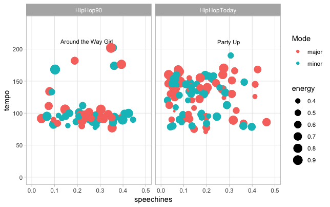

# Description of the Project 

How does hip-hop from the 1990s differ from hip-hop today? With the aim to answer to this question, I decided to look for reliable playlists on Spotify through which I could gain valuable insight into the most remarkable differences within and between the two time periods. In order to do so, I chose as corpus of data two playlists, namely "Hip Hop 90s" from "Hip Hop Heroes" and "Hip Hop 2019: Top100 Rap HITS 2019 / Rap 2019 New Hip Hop Songs" from "Filtr Espana", and I decided to analyse them and to compare their key features. These two playlists were chosen since they presented similar features in terms of number of followers and number of tracks, and also they contained tracks from the most famous and representative artists of the two time periods.
After i got the audio features from both playlists using "spotifyr", I decided to combine both the data sets in a scatterplot but by keeping them separated into two different charts with speechiness on the x-axis and tempo on the y-axis. As a result, it could be observed on the scatterplot that overall Hip-Hop got significantly faster in 20 years, since most of the 90's tracks have less than 100 BPM while most of the today's tracks entirely cover the range from 100 BPM to 175. In addition, from the scatterplot could be observed also a couple of outliers, which were two today's hip hop songs, namely "Around the Way Girl" and "Party Up" (the two songs shold be both in the today's chart, I commited an oversight in labelling, I'm sorry for that), that surprisingly were above the 200 BPM, representing the fastest track of both data sets. However, after I listened to both the songs, I must say that in this case Spotify's tempo detection was far from the truth. Moreover, the values of speechiness were slightly higher for the 90's tracks, demonstrating a little decrease of the use of spoken words in today's tracks. But here too, there was an outlier represented by today's track "Zone 6 (Remix) (feat. Future & 6LACK)", which had the highest amount of spoken words with the value of 0.6490. 
Subsequently, I obtained the average danceability and energy for both playlists but I did not find any remarkable difference for these features, the values of which were marginally higher in 90's tracks. However, I wanted anyway to map the energy of the tracks to the size of the dots in the charts, in order to find out something new in the future.
Finally, as it can be observed in the scatterplot the dots are coloured by "mode", but in both playlist i found a certain balance between songs in major and in minor and there was no remarkable trend to be noticed.
The increasing acceleration of today's Hip Hop tracks appear to be at the moment the most interesting findings. 

  

